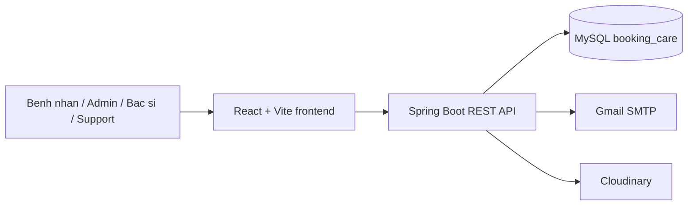

# Bookingcare

Bookingcare la he thong dat lich kham benh gom backend Spring Boot va frontend React/Vite. Du an ho tro benh nhan tim bac si, phong kham, chuyen khoa, dat lich kham, xem hoa don; dong thoi cung cap dashboard quan tri cho admin, bac si va nhan vien ho tro.

## Repo lien quan

| Thanh phan | Duong dan |
| --- | --- |
| Backend API | https://github.com/ndvuongq04/be_booking-care |
| Frontend Web | https://github.com/PhucPoo/FE_BookingCare |
| GitHub root repo | https://github.com/ndvuongq04/Bookingcare |

## Demo

Hien repo chua co public demo URL duoc cau hinh san. Khi chay local:

| Dich vu | URL |
| --- | --- |
| Frontend | http://localhost:5173 |
| Backend | http://localhost:8080 |
| API base | http://localhost:8080/api/v1 |

Tai khoan demo duoc seed khi database rong:

```text
Email: superAdmin01@gmail.com
Password: 123456
Role: ADMIN
```

## Tinh nang chinh

### Public / Khach vang lai

- Xem trang chu, danh sach co so y te, bac si, chuyen khoa, bai viet va dich vu y te.
- Xem chi tiet co so y te, chi tiet bac si, chi tiet chuyen khoa va dich vu kham chuyen khoa.
- Tim kiem bac si, phong kham, chuyen khoa va dich vu.
- Xem khung gio kham con trong cua bac si.
- Dang ky tai khoan, xac thuc OTP qua email, dang nhap va quen mat khau.

### CLIENT / Benh nhan

- Cap nhat thong tin ca nhan va doi mat khau.
- Dat lich kham voi bac si theo ngay va khung gio.
- Xem danh sach lich kham ca nhan, xem chi tiet lich va huy lich khi can.
- Xem danh sach hoa don/chi tiet hoa don cua minh.
- Gui, cap nhat va xoa phan hoi cho bac si sau khi su dung dich vu.
- Xem ho so kham benh lien quan den minh.

### ADMIN

- Xem dashboard thong ke doanh thu va so lich kham thanh cong theo ngay, thang, nam.
- Quan ly tai khoan nguoi dung, bac si, nhan vien ho tro va benh nhan.
- Quan ly phong kham, chuyen khoa va lien ket phong kham - chuyen khoa.
- Quan ly dich vu y te.
- Quan ly toan bo lich kham, tim kiem lich kham va cap nhat trang thai lich.
- Quan ly hoa don va tra cuu hoa don.
- Quan ly phan hoi, thong bao, ho so kham benh va cac danh muc he thong.

### DOCTOR / Bac si

- Xem dashboard bac si.
- Xem, tim kiem va quan ly lich kham cua bac si.
- Cap nhat trang thai lich kham.
- Quan ly danh sach benh nhan phu trach.
- Tao va cap nhat ho so kham benh.
- Cap nhat thong tin ho so bac si.

### SUPPORT / Nhan vien ho tro

- Xem dashboard ho tro.
- Xem va tim kiem lich kham theo phong kham.
- Cap nhat trang thai lich kham trong pham vi ho tro.
- Tao hoa don va quan ly hoa don theo phong kham.
- Xem thong tin phong kham duoc gan va cap nhat thong tin ho tro.

### He thong

- Xac thuc bang JWT, refresh token va phan quyen theo role `ADMIN`, `DOCTOR`, `SUPPORT`, `CLIENT`.
- Gui email OTP, quen mat khau, thong bao dat lich thanh cong va huy lich.
- Upload va quan ly hinh anh qua Cloudinary.

## Kien truc tong quan



Backend expose REST API tai `/api/v1`. Frontend goi API bang Axios, luu thong tin dang nhap trong Zustand/local storage va cookie `access_token`, sau do dieu huong nguoi dung theo role.

## Tech stack tong hop

| Lop | Cong nghe |
| --- | --- |
| Frontend | React 19.1.1, TypeScript 5.8, Vite 7.1, React Router 7.8 |
| UI | Ant Design 5, Tailwind CSS 4, React Icons, Swiper, React Slick |
| State/API | Zustand, Axios, React Hook Form, React Toastify |
| Chart | Chart.js, react-chartjs-2, Recharts, react-countup |
| Backend | Java 17, Spring Boot 3.5.5, Spring Web, Spring Security, OAuth2 Resource Server |
| Data | Spring Data JPA, Hibernate, MySQL 8 |
| Email/template | Spring Mail, Thymeleaf |
| Storage | Cloudinary |
| Build | Maven Wrapper 3.9.11, npm |

## Cau truc repo

```text
Bookingcare/
|-- README.md
|-- be_booking-care/
|   |-- pom.xml
|   |-- mvnw, mvnw.cmd
|   |-- src/main/java/com/Booking_care/
|   |-- src/main/resources/application.properties
|   `-- src/test/java/
`-- fe_booking-care/
    |-- package.json
    |-- vite.config.ts
    |-- tsconfig*.json
    |-- db.sql
    `-- src/
```

## Chay local nhanh

Yeu cau:

- Java 17+
- MySQL 8+
- Node.js 20.19+ hoac 22.12+ cho Vite 7
- npm 10+

Chay backend:

```powershell
cd be_booking-care
.\mvnw.cmd spring-boot:run
```

Chay frontend o terminal khac:

```powershell
cd fe_booking-care
npm install
npm run dev
```

Mac dinh backend dung database `booking_care` tren MySQL local. Cau hinh chi tiet nam trong [be_booking-care/README.md](./be_booking-care/README.md).

## Cau truc deploy

Repo hien chua co Dockerfile, docker-compose hoac script deploy san. Huong deploy phu hop voi code hien tai:

| Thanh phan | Cach deploy de xuat |
| --- | --- |
| Frontend | `npm run build`, deploy folder `dist/` len Nginx, Vercel, Netlify hoac static hosting |
| Backend | `.\mvnw.cmd clean package`, deploy file JAR trong `target/` len VPS/cloud/server Java 17 |
| Database | MySQL 8, tao database `booking_care`, de JPA tao schema hoac import dump `fe_booking-care/db.sql` neu can data mau |
| Secrets | Chuyen MySQL password, JWT secret, Gmail app password va Cloudinary credentials sang bien moi truong hoac secret manager |

## Tai lieu chi tiet

- [Backend README](./be_booking-care/README.md)
- [Frontend README](./fe_booking-care/README.md)

## Tac gia va lien he

- GitHub: https://github.com/ndvuongq04
- LinkedIn: https://www.linkedin.com/in/v%C6%B0%E1%BB%A3ng-nguy%E1%BB%85n-%C4%91%C3%ACnh-a6aa42397/
- Email: nguyendinhvuong08122004@gmail.com
